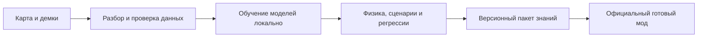

# Архитектура и этапы Bot Training Studio

## Граница с игровым модом

Студия развивается в самостоятельном репозитории. Работа над ней не изменяет
активную кодовую базу OpenTDM-X и Mapgen Studio.

Это целевой конвейер. В версии 0.2 реализованы A, наблюдательный эксперимент M,
проверки обычного движения V и офлайн-пакет P. Игровой загрузчик и полная
тактическая квалификация ещё не готовы. Сгенерированный `motion-prior.c` — диагностический стенд
сравнения, не требование пользователю компилировать мод.

Общий опыт стрельбы, ухода, добивания и подбора предметов относится к общим
механикам. Геометрия, соединения, тайминги, выгодные позиции и сочетания
предметов образуют тактику конкретной карты. Донорский стиль — отдельный слой,
а не копия карты. Новое обучение проверяет ранее изученные карты: положительный
результат на новой карте сам по себе не разрешает регрессии на старых.

Планируемый официальный runtime должен один раз получить универсальный
ограниченный интерпретатор данных, динамический реестр карт/профилей и запрос
своих возможностей. Затем пользователь устанавливает знания без изменения
DLL/SO. Если в старом моде отсутствует нужная механика, студия сообщает о
несовместимости; новые данные не могут добавить несуществующий машинный код.

Пакет связывается с хешем BSP, физикой, схемой признаков и требуемыми
возможностями runtime. Никакого произвольного DLL, Python, Lua или исполняемого
кода из обучения. Ограничиваются размеры, число узлов и стоимость вычислений.
Сначала проверка и staging, затем атомарное переключение поколения с откатом;
заводские данные не уничтожаются.

## Модели и оборудование

Текущие Transformer-профили — кандидаты для исследований движения. В них
от 0,4 до 56,8 млн параметров. Они не объявляются полноценным тактическим
интеллектом и не заменяют исследование модели для всего игрового состояния.
Привязка классов Large/XL к 24/32 ГБ — план по масштабу задач, а не измеренное
минимальное требование: короткая синтетическая проба использует намного меньше.

Следующая модель должна видеть последовательность состояний, геометрию,
цели/предметы/тайминги и взаимодействие игроков; нужны отдельные оценки
маршрутов, стрельбы и решений, а не единственная ошибка скорости движения.
Выбор модели проводится по удержанным матчам и испытаниям в игровой физике.
Количество параметров само по себе не является метрикой качества.

Требования к следующему этапу масштабирования: свободная память и пробная
обучающая итерация; управляемые размер пакета и длина истории, смешанная
точность, накопление градиента, checkpointing активаций; восстановление после
OOM, явное переключение на меньший профиль или CPU. Общего ограничения 4 ГБ
не будет. Смена архитектуры модели должна проходить отдельную миграцию или
дистилляцию; несовместимые веса не загружаются молча.

NVIDIA CUDA и CPU проверены в 0.1. ROCm/XPU пока являются программными путями,
а не подтверждённой поддержкой любых AMD/Intel GPU. Упаковка отдельных сред и
проверки конкретных устройств обязательны до объявления такой поддержки.

## Дообучение и достоверность

На совпавшей карте предлагаются: дообучить, обучить новое поколение, отменить.
Хранятся история происхождения, хеши данных, модель, повтор старых наблюдений
и результаты. Связанные записи одного матча не должны попасть в разные
обучающую и проверочную выборки. Ники сравниваются с нормализацией оформления
и контролируемой нечёткой похожестью; неоднозначная идентификация требует
разрешения, а не произвольного выбора донора. Фразы принадлежат выбранному
игроку; распространение пользовательских демок/чатов по умолчанию выключено.

В последовательном датасете история составляет 4–128 наблюдений; цели —
скорость/оружие через 300 мс и смещение/изменение ресурсов/близость предметов
через три секунды. Близость не означает подтверждённый подбор. Формат
`observed-game-sequence-v3` сохраняет первый кадр смерти и короткую историю
после респавна. Смерть завершает эпизод; разрыв записи делает будущее
неизвестным, а координаты нового респавна не становятся целью перемещения.
Каждая непрерывная цель и каждый исход имеют собственную маску наблюдения.
После смерти не подставляются фиктивные координаты или здоровье на третьей
секунде. Для якоря нужны хотя бы два последовательных наблюдения; первый
одиночный кадр жизни пока не образует обучающий пример.

Добавлены наблюдаемый боезапас текущего оружия, возраст последнего
наблюдаемого выстрела и скорость противника с масками неизвестности.
Это не полный инвентарь и не гарантия готовности оружия к выстрелу.
Три вероятностных выхода: смерть, суммарная наблюдаемая потеря не менее
20 единиц здоровья/брони и прирост здоровья/брони за три секунды либо до
смерти. Потери включают урон себе, а прирост не устанавливает конкретный
подобранный предмет. Убывание мегахелса по одной единице не должно само
по себе обозначать существенную потерю стека.

Редкие смены оружия получают ограниченный дополнительный вес только на
обучающих данных. Проверочные выборки не балансируются по ответам.
Отчёты содержат качество после реальной смены оружия, сохранение текущего,
Brier score и average precision исходов, а также результаты по группам
матчей. Дообучение сохраняет прогнозы движения и вероятностей старой модели;
прошедшие базовое сравнение исходы проверяются на регресс отдельно.
Наблюдательные прогнозы не квалифицируют оптимальную тактическую политику.

Условные профили стиля группируют движение и оружие по дистанции, здоровью,
броне, лучу видимости и относительной высоте. Каждая запись имеет равный вес;
используются только тренировочные матчи, неопределённые условия остаются
неопределёнными. Это проверяемое описание привычек, не полный клон игрока.
DM2 не восстанавливает все исходные usercmd/скрытые состояния: отсутствие
наблюдения не выдаётся за установленный факт. Подтверждение манёвров требует
повторения в совместимой игровой физике.

## Реализованный протокол приложения

UI (.NET/Avalonia) запускает Python-worker без командной оболочки. Задание —
JSON с protocol=1 и идентификатором; события JSONL имеют последовательные
номера. Завершение, ошибка и отмена различаются, exit code проверяется.
Каталог задания содержит запрос, журнал и результат. Отмена кооперативная,
проверяется между пакетами, эпохами и перед активацией; текущая GPU-операция
сначала заканчивается. Завершённая эпоха сохраняет модель, оптимизатор,
состояние выборки и эталон прежней модели. Незавершённая эпоха начинается заново.

Модели хранятся в safetensors, табличные данные читаются без pickle.
Атомарный указатель переключается только на принятое **офлайн-поколение**.
Автоматической установки этих результатов на сервер нет.

## Следующие этапы

1. Автономный разбор BSP/DM2/MVD2, проект и библиотека без внешнего анализатора;
   наблюдаемые последовательности и проверка происхождения/прав на данные.
2. Модель игрового состояния/решений, масштабирование ресурсов и сравнение
   кандидатов на картах и игроках, отсутствующих в обучении.
3. Встроенный совместимый стенд физики, проверка маршрутов/триксов/выстрелов,
   причин неудачи, перенос общих механик без регрессий старых карт.
4. Согласованный runtime-контракт и официальный загрузчик в моде; это отдельная
   работа после координации с разработчиком текущей версии ботов.
5. Управляемая установка ML-среды, длительные возобновляемые задания, полный
   донорский профиль и фразы, пользовательский установщик и документация.
